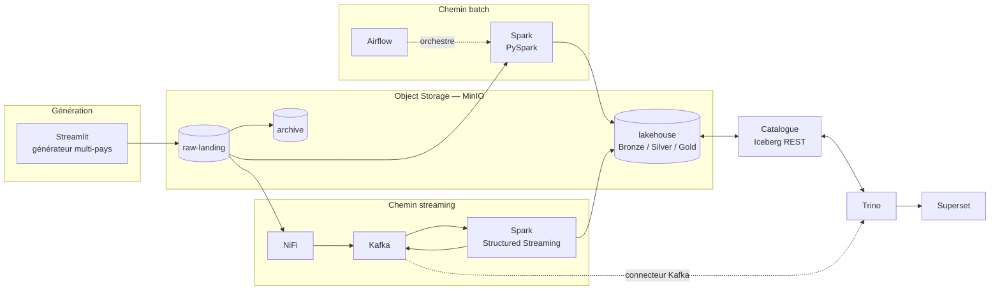

# WABA Group — Plateforme Analytique Financière Multi-Pays

Plateforme Data Lakehouse pour **WestAfrica BancAssur Group**, groupe fictif de banque et
d'assurance implanté dans 8 pays d'Afrique de l'Ouest (CI, SN, ML, BF, GN, TG, BJ, GH).
Réponse au challenge Data Engineer Artefact.

L'architecture suit un **pattern Lambda** organisé autour d'un object storage central
(MinIO + Apache Iceberg) exposé en SQL via Trino.



---

## État d'avancement

| Niveau | Périmètre | État |
|---|---|---|
| **Level 1** | Ingestion & Lakehouse batch (Streamlit, MinIO, Spark, Iceberg, Trino) | ✅ Complet — générateur, ingestion Spark, 8 tables `raw.*` idempotentes |
| **Level 2** | Orchestration Airflow & architecture Médaillon | 🟡 Médaillon et 4 DAGs opérationnels — validation en cours |
| **Level 3** | Pipeline hybride batch & streaming (NiFi, Kafka, Spark Streaming) | ⬜ À venir |
| **Level 4** | Kubernetes, gouvernance & observabilité | ⬜ À venir |

---

## Prérequis

| Outil | Version testée | Remarque |
|---|---|---|
| Docker Engine | 29.x | Docker Desktop sous Windows/macOS |
| Docker Compose | v2 | inclus dans Docker Desktop |
| RAM allouée à Docker | **8 Go minimum** | voir « Contrainte mémoire » plus bas |
| GNU Make | optionnel | sous Windows, utiliser `.\waba.ps1` |

Trois points d'entrée équivalents, qui appellent tous le même `docker compose` : le **`Makefile`**
sous Linux et macOS, **`waba.ps1`** sous PowerShell, et les scripts **`scripts/*.sh`** depuis bash.
`make help` et `.\waba.ps1 help` listent les commandes disponibles.

## Démarrage rapide

```bash
git clone <url-du-depot> && cd WABA
cp README.env.example .env     # aucune valeur secrète à renseigner en local
make up-l1                     # MinIO + Iceberg REST + Trino + générateur
make smoke-l1                  # vérifie la chaîne de bout en bout
```

Sous Windows (PowerShell) :

```powershell
Copy-Item README.env.example .env
.\waba.ps1 up-l1
.\waba.ps1 smoke-l1
```

Interfaces exposées :

| Service | URL | Identifiants |
|---|---|---|
| **Générateur (Streamlit)** | http://localhost:8501 | aucun (dev local) |
| **Airflow** (profil `l2`) | http://localhost:8090 | `admin` / cf. `.env` |
| Console MinIO | http://localhost:9001 | ceux du `.env` |
| Trino | http://localhost:8080 | aucun (dev local) |
| Catalogue Iceberg REST | http://localhost:8181 | — |

### Vérifier

`make smoke-l1` enchaîne neuf contrôles : buckets présents, catalogue Iceberg exposé dans Trino,
aller-retour SQL sur une table partitionnée par `country_code`, objets réellement écrits dans
`s3://lakehouse`, génération d'un jeu de données sur les 8 pays, conformité de ces données,
ingestion Spark vers les 8 tables `raw.*`, **preuve d'idempotence** — le même jeu est redéposé puis
réingéré et le nombre de lignes doit être strictement inchangé — et enfin exécution des requêtes
analytiques. Il sort en code non nul au moindre échec : c'est le contrôle de non-régression du niveau.

Ingérer la zone d'atterrissage vers les tables Iceberg :

```bash
make ingest-l1
```

Fusionner les petits fichiers Parquet accumulés par les ingestions successives :

```bash
make compact-l1
```

Exécuter les requêtes analytiques du §1.4 — soldes par pays, volumes de transactions, comptages par
entité, traçabilité de l'ingestion, santé du partitionnement — dont le SQL commenté vit dans
[`sql/level1/`](sql/level1) :

```bash
make queries-l1
```

Peupler le bucket sans passer par l'interface, par exemple pour préparer une démonstration :

```bash
docker compose --env-file .env -f docker/compose.yml exec streamlit python -m generator.seed --preset full
```

Contrôler la conformité des données déjà déposées (intégrité référentielle, nomenclature,
partitionnement par pays, détectabilité des anomalies) :

```bash
docker compose --env-file .env -f docker/compose.yml exec streamlit python -m generator.verify
```

Tests unitaires (hors conteneur, sans infrastructure) :

```bash
pip install -r requirements-dev.txt && PYTHONPATH=. pytest tests/ -q
```

### Explorer en SQL

Ouvrir un shell Trino interactif — sous Linux ou macOS :

```bash
make sql
```

Sous Windows (PowerShell) :

```powershell
.\waba.ps1 sql
```

Depuis Git Bash sous Windows, préfixer par `winpty` : sans lui, le shell ne fournit pas de vrai
terminal et le client Trino bascule en mode dégradé, sans historique ni édition de ligne.

```bash
winpty docker compose --env-file .env -f docker/compose.yml exec trino trino
```

Quelques points de départ une fois dans le shell :

```sql
SHOW TABLES FROM iceberg.raw;
DESCRIBE iceberg.raw.bank_transactions;

-- Rend visible la matrice pays × entité : le mobile money ne doit apparaître
-- qu'en BF, CI, GH, SN et la microfinance qu'en BF, GN, ML.
SELECT entity_type,
       array_join(array_agg(DISTINCT country_code ORDER BY country_code), ', ') AS pays
FROM iceberg.raw.customers
GROUP BY 1;

-- Métadonnées Iceberg : historique des instantanés, qui matérialise la preuve
-- d'idempotence — le premier ajoute 16 000 lignes, les réingestions suivantes
-- n'en ajoutent aucune. `element_at` plutôt qu'un accès direct : la clé
-- `added-records` est absente des instantanés qui n'ont rien inséré.
-- Les guillemets sont obligatoires et ne survivent pas à un passage en ligne
-- de commande — d'où l'intérêt du shell interactif.
SELECT committed_at, operation,
       element_at(summary, 'added-records') AS lignes_ajoutees,
       element_at(summary, 'total-records') AS lignes_totales
FROM iceberg.raw."bank_transactions$snapshots"
ORDER BY committed_at;

SELECT partition, record_count, file_count
FROM iceberg.raw."bank_transactions$partitions"
ORDER BY record_count DESC LIMIT 10;
```

Pour une requête ponctuelle sans ouvrir de session, `--execute` ne réclame aucun terminal :

```bash
docker compose --env-file .env -f docker/compose.yml exec -T trino trino --output-format ALIGNED --execute "SHOW TABLES FROM iceberg.raw"
```

L'interface web de Trino sur http://localhost:8080 est une **console de supervision** — requêtes en
cours, temps d'exécution, volumes lus, élagage des partitions — et non un éditeur SQL.

## Le générateur

L'application Streamlit (Level 1.1) produit des données simulant l'activité du groupe et les dépose
dans `raw-landing`, organisées en sous-dossiers pays / type, à la nomenclature
`bank_txn_[CC]_YYYYMMDD_NN.csv`.

Trois partis pris qui la distinguent d'un générateur aléatoire :

- **L'implantation du groupe est respectée.** Le mobile money n'existe qu'en CI, SN, BF et GH, la
  microfinance qu'au ML, GN et BF, conformément au tableau des entités.
- **Les KPIs réglementaires sont calibrés, pas subis.** Le taux de créances douteuses est ciblé par
  pays dans la fourchette 3-8 %, et les sinistres sont dimensionnés à partir des primes encaissées
  pour atteindre le loss ratio visé par branche. Sans cela, les tables Gold du Level 2 afficheraient
  des ratios aberrants.
- **Les anomalies sont injectées volontairement.** Rafales de virements, paiements depuis un pays
  inhabituel, sinistres disproportionnés : aucune de ces situations ne survient par hasard, et sans
  elles les règles de détection du Level 3 n'auraient rien à signaler.
- **Un fichier par pays et par journée**, comme le veut la nomenclature `bank_txn_CI_20260101_01.csv`
  où la date désigne le jour des transactions contenues. Un fichier couvrant tout un trimestre
  respecterait la forme du nom mais éparpillerait les données sur 720 partitions Iceberg de
  quelques dizaines de lignes, multipliant par dix le stockage par ligne.

## Le Level 2 : médaillon et orchestration

```bash
make up-l2        # socle + Airflow (http://localhost:8090)
make medallion-l2 # construit Bronze, Silver et Gold
make smoke-l2     # vérifie les critères du niveau
make queries-l2   # requêtes analytiques du Level 2
```

`make smoke-l2` construit le médaillon puis contrôle en neuf étapes : les trois zones existent avec
des contenus distincts, les transformations Silver satisfont les quatre exigences du §2.2, les
7 tables Gold sont requêtables et filtrables par pays, **les KPIs réglementaires tombent dans leurs
fourchettes** (NPL 3-8 %, loss ratio 50-85 %), le rapport J+1 est produit, les 4 DAGs s'analysent
sans erreur, aucun identifiant n'apparaît dans le code, et recalculer Silver ou Gold ne duplique
rien.

**Les trois zones du médaillon.** `bronze.*` et `raw.*` désignent la même zone : l'énoncé emploie
les deux termes pour la même définition, et Bronze est exposée en vues plutôt que dupliquée.
`silver.*` porte la donnée nettoyée, dédupliquée, convertie en euros et enrichie par les
référentiels. `gold.*` porte les sept KPIs, plus le rapport réglementaire.

**Quatre DAGs, chaînés par jeux de données.** `dag_ingest_raw` s'exécute tous les quarts d'heure et
publie `iceberg://waba/raw` ; `dag_bronze_to_silver` s'y abonne et publie Silver ;
`dag_silver_to_gold` s'y abonne à son tour. Décrire ce que chaque DAG produit et consomme, plutôt
que de coder qui déclenche qui, permet d'ajouter demain un consommateur sans toucher à l'amont.
`dag_regulatory_report` est planifié à 00h30 UTC pour la journée écoulée, avec rattrapage activé —
une déclaration réglementaire manquée reste due.

**Les jobs Spark ne s'exécutent pas dans Airflow.** Chaque tâche démarre un conteneur `waba/spark`
éphémère via le socket Docker. Embarquer Spark dans l'image Airflow l'alourdirait d'un gigaoctet
pour dupliquer un environnement existant ; surtout, ce découplage est celui que le Level 4 reprendra
en remplaçant `DockerOperator` par `SparkKubernetesOperator`.

**Aucun identifiant dans le code des DAGs.** Les accès MinIO sont déclarés comme une *Connection*
Airflow et référencés par `{{ conn.waba_minio.login }}`, résolu à l'exécution de la tâche. Les
paramètres d'environnement passent par des *Variables*. Chaque DAG accepte un paramètre `countries`
permettant de rejouer un seul pays après correction.

## Contrainte mémoire — pourquoi des profils

La plateforme complète du Level 4 dépasse 24 Go de RAM. Le développement étant mené sur une machine
de 16 Go, les services sont regroupés en **profils Compose exclusifs** (`l1`, `l2`, `l3`, `l4`)
plutôt que cumulatifs, et chaque service porte une `mem_limit` explicite. Les arbitrages
correspondants (catalogue REST plutôt que Hive Metastore, Spark en local mode, Kafka en KRaft,
Airflow en LocalExecutor) sont justifiés dans [`writeup/decisions.md`](writeup/decisions.md).

Sous Windows, plafonner la mémoire de WSL2 via `%USERPROFILE%\.wslconfig` avant de démarrer Docker :

```ini
[wsl2]
memory=10GB
processors=6
swap=8GB
```

## Structure du dépôt

```
.
├── docker/              # compose.yml (profils par niveau) et configuration des services
│   ├── spark/           # image d'exécution des jobs (Iceberg + S3A)
│   ├── streamlit/       # image du générateur
│   └── trino/catalog/   # catalogues Trino (credentials injectés par variables d'env)
├── common/              # socle partagé générateur / jobs Spark
│   ├── domain.py        #   périmètre, devises, matrice pays × entité, seuils
│   └── pii.py           #   pseudonymisation et masquage
├── generator/           # Level 1.1 — génération de données
│   ├── config.py        #   périmètre, matrice pays × entité, seuils réglementaires
│   ├── referentials.py  #   clients, comptes, agences, produits
│   ├── transactions.py  #   les 4 flux transactionnels
│   ├── calibration.py   #   cibles NPL et loss ratio
│   ├── anomalies.py     #   injection ET détection de référence des fraudes
│   ├── storage.py       #   dépôt dans MinIO
│   ├── service.py       #   orchestration d'un cycle
│   ├── app.py           #   interface Streamlit
│   ├── seed.py          #   amorçage en ligne de commande
│   └── verify.py        #   conformité des données déposées
├── jobs/
│   ├── batch/           # Levels 1-2 — ingestion et transformations PySpark
│   │   ├── session.py   #   session Spark (catalogue Iceberg REST + accès S3A)
│   │   ├── schemas.py   #   schémas explicites, DDL et clés d'idempotence
│   │   ├── quality.py   #   validation et motifs de rejet
│   │   ├── landing.py   #   recensement et archivage des fichiers
│   │   ├── ingest_raw.py#   ingestion vers les 8 tables raw.*
│   │   ├── layers.py    #   socle des transformations (devise, PII, MERGE)
│   │   ├── silver.py    #   nettoyage, conversion, enrichissement
│   │   ├── gold.py      #   les 7 KPIs du §2.3
│   │   ├── regulatory.py#   agrégats BCEAO et CIMA
│   │   └── compact.py   #   fusion des petits fichiers Parquet
│   └── streaming/       # Level 3 — Spark Structured Streaming
├── airflow/dags/        # Level 2 — les 4 DAGs et leur socle commun
├── jobs/
│   ├── batch/           # Levels 1-2 — jobs PySpark (raw -> bronze -> silver -> gold)
│   └── streaming/       # Level 3  — jobs Spark Structured Streaming
├── airflow/dags/        # Level 2  — DAGs d'orchestration
├── nifi/                # Level 3  — templates de flux NiFi
├── superset/            # Level 4  — définitions des dashboards
├── k8s/                 # Level 4  — manifestes et charts Helm
├── sql/level1/          # requêtes analytiques du §1.4, montées dans Trino
├── scripts/             # tests de fumée et utilitaires
├── tests/               # tests unitaires
└── writeup/             # write-up technique (rédigé au fil de l'eau)
```

## Sécurité & données personnelles

- Aucun credential n'est écrit en dur : les fichiers de configuration Trino résolvent les clés
  d'accès à l'exécution via `${ENV:...}`, et `.env` est exclu du dépôt.
- Les données manipulées sont **entièrement synthétiques**. Les champs identifiants (`customer_id`,
  `account_number`, `iban`) sont néanmoins pseudonymisés dans les couches exposées, conformément aux
  contraintes du sujet.
