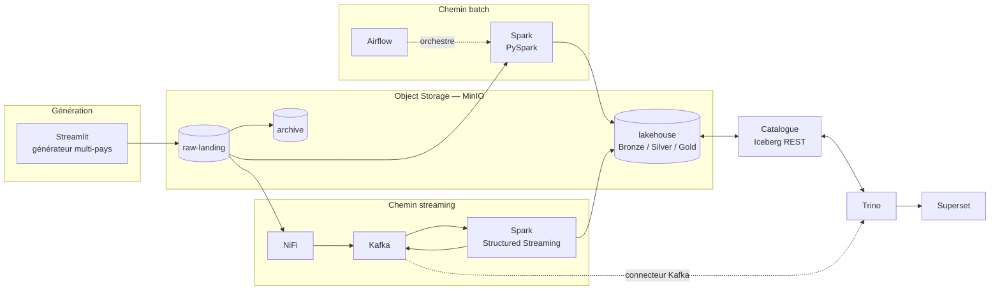

# WABA Group — Plateforme Analytique Financière Multi-Pays

Plateforme Data Lakehouse pour **WestAfrica BancAssur Group**, groupe fictif de banque et
d'assurance implanté dans 8 pays d'Afrique de l'Ouest (CI, SN, ML, BF, GN, TG, BJ, GH).
Réponse au challenge Data Engineer Artefact.

L'architecture suit un **pattern Lambda** organisé autour d'un object storage central
(MinIO + Apache Iceberg) exposé en SQL via Trino.



---

## État d'avancement

| Niveau | Périmètre | État |
|---|---|---|
| **Level 1** | Ingestion & Lakehouse batch (Streamlit, MinIO, Spark, Iceberg, Trino) | ✅ Complet — générateur, ingestion Spark, 8 tables `raw.*` idempotentes |
| **Level 2** | Orchestration Airflow & architecture Médaillon | ✅ Complet — médaillon Bronze/Silver/Gold, 7 KPIs, 4 DAGs chaînés par Datasets |
| **Level 3** | Pipeline hybride batch & streaming (NiFi, Kafka, Spark Streaming) | ✅ Complet — NiFi → Kafka, 2 jobs streaming, DLQ, requête Lambda unifiée, 10 contrôles de fumée |
| **Level 4** | Kubernetes, gouvernance & observabilité | ⬜ À venir |

---

## Prérequis

| Outil | Version testée | Remarque |
|---|---|---|
| Docker Engine | 29.x | Docker Desktop sous Windows/macOS |
| Docker Compose | v2 | inclus dans Docker Desktop |
| RAM allouée à Docker | **8 Go minimum** | voir « Contrainte mémoire » plus bas |
| GNU Make | optionnel | sous Windows, utiliser `.\waba.ps1` |

Trois points d'entrée équivalents, qui appellent tous le même `docker compose` : le **`Makefile`**
sous Linux et macOS, **`waba.ps1`** sous PowerShell, et les scripts **`scripts/*.sh`** depuis bash.
`make help` et `.\waba.ps1 help` listent les commandes disponibles.

## Démarrage rapide

```bash
git clone <url-du-depot> && cd WABA
cp README.env.example .env     # aucune valeur secrète à renseigner en local
make up-l1                     # MinIO + Iceberg REST + Trino + générateur
make smoke-l1                  # vérifie la chaîne de bout en bout
```

Sous Windows (PowerShell) :

```powershell
Copy-Item README.env.example .env
.\waba.ps1 up-l1
.\waba.ps1 smoke-l1
```

Interfaces exposées :

| Service | URL | Identifiants |
|---|---|---|
| **Générateur (Streamlit)** | http://localhost:8501 | aucun (dev local) |
| **Airflow** (profil `l2`) | http://localhost:8090 | `admin` / cf. `.env` |
| **NiFi** (profil `l3`) | https://localhost:8091/nifi | cf. `.env` — certificat auto-signé |
| Console MinIO | http://localhost:9001 | ceux du `.env` |
| Trino | http://localhost:8080 | aucun (dev local) |
| Catalogue Iceberg REST | http://localhost:8181 | — |

### Vérifier

`make smoke-l1` enchaîne neuf contrôles : buckets présents, catalogue Iceberg exposé dans Trino,
aller-retour SQL sur une table partitionnée par `country_code`, objets réellement écrits dans
`s3://lakehouse`, génération d'un jeu de données sur les 8 pays, conformité de ces données,
ingestion Spark vers les 8 tables `raw.*`, **preuve d'idempotence** — le même jeu est redéposé puis
réingéré et le nombre de lignes doit être strictement inchangé — et enfin exécution des requêtes
analytiques. Il sort en code non nul au moindre échec : c'est le contrôle de non-régression du niveau.

Ingérer la zone d'atterrissage vers les tables Iceberg :

```bash
make ingest-l1
```

Fusionner les petits fichiers Parquet accumulés par les ingestions successives :

```bash
make compact-l1
```

Exécuter les requêtes analytiques du §1.4 — soldes par pays, volumes de transactions, comptages par
entité, traçabilité de l'ingestion, santé du partitionnement — dont le SQL commenté vit dans
[`sql/level1/`](sql/level1) :

```bash
make queries-l1
```

Peupler le bucket sans passer par l'interface, par exemple pour préparer une démonstration :

```bash
docker compose --env-file .env -f docker/compose.yml exec streamlit python -m generator.seed --preset full
```

Contrôler la conformité des données déjà déposées (intégrité référentielle, nomenclature,
partitionnement par pays, détectabilité des anomalies) :

```bash
docker compose --env-file .env -f docker/compose.yml exec streamlit python -m generator.verify
```

Tests unitaires (hors conteneur, sans infrastructure) :

```bash
pip install -r requirements-dev.txt && PYTHONPATH=. pytest tests/ -q
```

### Explorer en SQL

Ouvrir un shell Trino interactif — sous Linux ou macOS :

```bash
make sql
```

Sous Windows (PowerShell) :

```powershell
.\waba.ps1 sql
```

Depuis Git Bash sous Windows, préfixer par `winpty` : sans lui, le shell ne fournit pas de vrai
terminal et le client Trino bascule en mode dégradé, sans historique ni édition de ligne.

```bash
winpty docker compose --env-file .env -f docker/compose.yml exec trino trino
```

Quelques points de départ une fois dans le shell :

```sql
SHOW TABLES FROM iceberg.raw;
DESCRIBE iceberg.raw.bank_transactions;

-- Rend visible la matrice pays × entité : le mobile money ne doit apparaître
-- qu'en BF, CI, GH, SN et la microfinance qu'en BF, GN, ML.
SELECT entity_type,
       array_join(array_agg(DISTINCT country_code ORDER BY country_code), ', ') AS pays
FROM iceberg.raw.customers
GROUP BY 1;

-- Métadonnées Iceberg : historique des instantanés, qui matérialise la preuve
-- d'idempotence — le premier ajoute 16 000 lignes, les réingestions suivantes
-- n'en ajoutent aucune. `element_at` plutôt qu'un accès direct : la clé
-- `added-records` est absente des instantanés qui n'ont rien inséré.
-- Les guillemets sont obligatoires et ne survivent pas à un passage en ligne
-- de commande — d'où l'intérêt du shell interactif.
SELECT committed_at, operation,
       element_at(summary, 'added-records') AS lignes_ajoutees,
       element_at(summary, 'total-records') AS lignes_totales
FROM iceberg.raw."bank_transactions$snapshots"
ORDER BY committed_at;

SELECT partition, record_count, file_count
FROM iceberg.raw."bank_transactions$partitions"
ORDER BY record_count DESC LIMIT 10;
```

Pour une requête ponctuelle sans ouvrir de session, `--execute` ne réclame aucun terminal :

```bash
docker compose --env-file .env -f docker/compose.yml exec -T trino trino --output-format ALIGNED --execute "SHOW TABLES FROM iceberg.raw"
```

L'interface web de Trino sur http://localhost:8080 est une **console de supervision** — requêtes en
cours, temps d'exécution, volumes lus, élagage des partitions — et non un éditeur SQL.

## Le générateur

L'application Streamlit (Level 1.1) produit des données simulant l'activité du groupe et les dépose
dans `raw-landing`, organisées en sous-dossiers pays / type, à la nomenclature
`bank_txn_[CC]_YYYYMMDD_NN.csv`.

Trois partis pris qui la distinguent d'un générateur aléatoire :

- **L'implantation du groupe est respectée.** Le mobile money n'existe qu'en CI, SN, BF et GH, la
  microfinance qu'au ML, GN et BF, conformément au tableau des entités.
- **Les KPIs réglementaires sont calibrés, pas subis.** Le taux de créances douteuses est ciblé par
  pays dans la fourchette 3-8 %, et les sinistres sont dimensionnés à partir des primes encaissées
  pour atteindre le loss ratio visé par branche. Sans cela, les tables Gold du Level 2 afficheraient
  des ratios aberrants.
- **Les anomalies sont injectées volontairement.** Rafales de virements, paiements depuis un pays
  inhabituel, sinistres disproportionnés : aucune de ces situations ne survient par hasard, et sans
  elles les règles de détection du Level 3 n'auraient rien à signaler.
- **Un fichier par pays et par journée**, comme le veut la nomenclature `bank_txn_CI_20260101_01.csv`
  où la date désigne le jour des transactions contenues. Un fichier couvrant tout un trimestre
  respecterait la forme du nom mais éparpillerait les données sur 720 partitions Iceberg de
  quelques dizaines de lignes, multipliant par dix le stockage par ligne.

## Le Level 2 : médaillon et orchestration

```bash
make up-l2        # socle + Airflow (http://localhost:8090)
make medallion-l2 # construit Bronze, Silver et Gold
make smoke-l2     # vérifie les critères du niveau
make queries-l2   # requêtes analytiques du Level 2
```

`make smoke-l2` construit le médaillon puis contrôle en neuf étapes : les trois zones existent avec
des contenus distincts, les transformations Silver satisfont les quatre exigences du §2.2, les
7 tables Gold sont requêtables et filtrables par pays, **les KPIs réglementaires tombent dans leurs
fourchettes** (NPL 3-8 %, loss ratio 50-85 %), le rapport J+1 est produit, les 4 DAGs s'analysent
sans erreur, aucun identifiant n'apparaît dans le code, et recalculer Silver ou Gold ne duplique
rien.

**Les trois zones du médaillon.** `bronze.*` et `raw.*` désignent la même zone : l'énoncé emploie
les deux termes pour la même définition, et Bronze est exposée en vues plutôt que dupliquée.
`silver.*` porte la donnée nettoyée, dédupliquée, convertie en euros et enrichie par les
référentiels. `gold.*` porte les sept KPIs, plus le rapport réglementaire.

**Quatre DAGs, chaînés par jeux de données.** `dag_ingest_raw` s'exécute tous les quarts d'heure et
publie `iceberg://waba/raw` ; `dag_bronze_to_silver` s'y abonne et publie Silver ;
`dag_silver_to_gold` s'y abonne à son tour. Décrire ce que chaque DAG produit et consomme, plutôt
que de coder qui déclenche qui, permet d'ajouter demain un consommateur sans toucher à l'amont.
`dag_regulatory_report` est planifié à 00h30 UTC pour la journée écoulée, avec rattrapage activé —
une déclaration réglementaire manquée reste due.

**Les jobs Spark ne s'exécutent pas dans Airflow.** Chaque tâche démarre un conteneur `waba/spark`
éphémère via le socket Docker. Embarquer Spark dans l'image Airflow l'alourdirait d'un gigaoctet
pour dupliquer un environnement existant ; surtout, ce découplage est celui que le Level 4 reprendra
en remplaçant `DockerOperator` par `SparkKubernetesOperator`.

**Une seule écriture de catalogue à la fois.** Toutes les tâches Spark passent par un *pool*
Airflow d'un seul emplacement. Le catalogue Iceberg persiste ses métadonnées dans un SQLite,
qui n'accepte qu'un écrivain : `max_active_runs` sérialise les exécutions d'un même DAG, mais
deux DAGs distincts peuvent commiter en même temps, et chaque tâche tournant dans son propre
conteneur, aucun verrou applicatif n'a de prise sur elles. Le pool est le seul point où la
contrainte s'exprime à l'échelle de l'ordonnanceur — un catalogue PostgreSQL le rendrait
inutile, ce que vise le Level 4.

**Aucun identifiant dans le code des DAGs.** Les accès MinIO sont déclarés comme une *Connection*
Airflow et référencés par `{{ conn.waba_minio.login }}`, résolu à l'exécution de la tâche. Les
paramètres d'environnement passent par des *Variables*. Chaque DAG accepte un paramètre `countries`
permettant de rejouer un seul pays après correction.

## Le Level 3 : ingestion temps réel

```bash
make up-l3        # socle + Airflow + Kafka + NiFi
make nifi-flow    # construit et démarre le flux d'ingestion
make nifi-status  # processeurs, files et seuils de contre-pression
make topics       # volumétrie des topics
```

**Le flux, en une ligne.** NiFi recense `raw-landing` toutes les 30 secondes, écarte les
référentiels, télécharge les fichiers de transactions, les découpe en événements JSON,
y ajoute `ingestion_timestamp` et `source_file` — les deux mêmes colonnes que la chaîne
batch — et publie chaque événement dans le topic de son jeu de données, avec le pays pour
clé de partition.

```
ListS3 ──▶ UpdateAttribute ──▶ RouteOnAttribute ──▶ FetchS3Object ──▶ SplitRecord
                                      │                   │               │
                                 (référentiels)           └───────┬───────┘
                                      ⊗                          ▼
                                                          UpdateRecord ──▶ PublishKafka
                                                                 │              │
                                                                 └──▶ rebut ──▶ dlq-financial-events
```

**Construit par script, pas exporté.** [`scripts/nifi_flow.py`](scripts/nifi_flow.py) crée
le contexte de paramètres, les six services de contrôle, les neuf processeurs et leurs
connexions par appels à l'API REST. Le fichier se relit et se compare d'une version à
l'autre, ce qu'un template exporté ne permet pas. Les noms de topics ne sont pas recopiés :
ils viennent de `common.domain`, la même source que les jobs Spark qui les consomment.

Le script est aussi le moyen d'exploitation du flux :

| Commande | Effet |
|---|---|
| `python scripts/nifi_flow.py` | détruit et reconstruit le flux, puis le démarre |
| `--status` | état des processeurs et remplissage des files |
| `--stop` / `--start` | suspend ou reprend sans détruire |
| `--reset-state` | efface l'état du recensement — rejoue tous les fichiers du bucket |
| `--delete` | supprime le flux et son contexte de paramètres |

**Aucun identifiant dans le flux.** Les clés MinIO sont déclarées comme paramètres
*sensibles* d'un contexte NiFi : le serveur les chiffre dans sa configuration et son API
ne les restitue jamais. Elles viennent de `.env`, comme partout ailleurs dans le projet.

**Contre-pression calibrée en escalier.** Les files sont dimensionnées bien en deçà des
valeurs par défaut de NiFi (10 000 objets, 1 Go) : 500 objets devant le producteur Kafka,
200 devant le téléchargement. Une file pleine suspend le processeur qui l'alimente, et la
saturation remonte jusqu'au recensement, qui cesse de lister. Le broker ne reçoit jamais
plus qu'il n'écoule, et les fichiers non traités restent dans MinIO.

**Deux modes d'échec, deux traitements.** Un fichier illisible part vers
`dlq-financial-events` avec son contenu, son nom et son motif de rejet en en-têtes de
message. Un broker indisponible n'est pas une donnée invalide : le lot est annulé plutôt
que publié à moitié, et la contre-pression fait le reste.

### Job 1 — Raw vers Silver

```bash
make stream-silver-once   # traite ce qui est disponible puis s'arrête
make stream-silver        # continu, micro-lots de 20 s
```

Le job consomme les quatre topics `raw-*`, valide chaque message, applique les
transformations Silver et écrit dans **deux destinations** : les topics `silver-*` et
les tables Iceberg `silver.*`.

**Ni les transformations ni la validation ne sont réécrites.** Les constructeurs de
[`jobs/batch/silver.py`](jobs/batch/silver.py) acceptent une source explicite : le job leur
passe le micro-lot au lieu de la table brute et obtient exactement les mêmes colonnes. Les
huit règles de [`jobs/batch/quality.py`](jobs/batch/quality.py) s'appliquent telles quelles,
puisqu'elles s'évaluent sur des colonnes encore textuelles — ce que NiFi publie. Le chemin
batch et le chemin streaming alimentent les mêmes tables ; deux définitions de Silver
auraient divergé sans jamais lever d'erreur.

**La file de rebut porte un motif exploitable**, pas un simple « message invalide » :

| Message publié | Motif dans `dlq-financial-events` |
|---|---|
| texte qui n'est pas du JSON | `message JSON illisible` |
| JSON sans `transaction_id` | `transaction_id manquant` |
| `"amount": "beaucoup"` | `amount non convertible en DOUBLE` |
| `country_code` CI et `currency` GHS | `devise incohérente avec le pays` |
| entité `MICROFINANCE` au Ghana | `entité absente de ce pays` |

Le message d'origine est conservé intact avec ses coordonnées Kafka : il pourra être rejoué
après correction, là où un journal d'erreur imposerait de le reconstituer.

**Deux déduplications superposées.** `dropDuplicatesWithinWatermark` écarte les doublons
rapprochés sur une fenêtre de 10 minutes, sans état non borné ; le `MERGE` Iceberg rattrape
les rejeux plus espacés. Mesuré : les 4 000 messages rejoués depuis le début des topics
laissent les tables Silver strictement inchangées.

### Job 2 — Silver vers Gold : fraude, AML et liquidité

```bash
make stream-gold-once   # traite ce qui est disponible puis s'arrête
make stream-gold        # continu
```

Trois règles de fraude, la surveillance AML et le suivi de liquidité alimentent trois topics
d'alertes et trois tables `gold.*`.

**Validé contre l'oracle du générateur.** `generator/anomalies.py` expose, en regard de
chaque injection, une implémentation de référence de la règle en pandas. Les alertes du job
sont comparées à ce que cet oracle trouve sur les mêmes fichiers — les deux partagent leurs
seuils via `common.domain`, mais aucune ligne de logique : l'un travaille en pandas sur un
fichier, l'autre en Spark sur un flux fenêtré.

| Règle | Oracle (pandas) | Job 2 (Spark Streaming) |
|---|---|---|
| Rafales de virements (fenêtre 5 min / 1 min) | 6 comptes, 18 virements | **6 comptes, 18 virements** |
| Origine inhabituelle (mobile money) | 20 paiements | **20 paiements** |
| Sinistre > 3× la prime annuelle | 1 sinistre | **1 sinistre** |
| AML — seuil déclaratif BCEAO | 58 virements | **58 virements** |

La liste des comptes incriminés est identique des deux côtés. Rejouer l'intégralité des
topics laisse les tables d'alertes inchangées : 27 alertes de fraude et 58 événements AML
avant comme après.

**Trois queries, pas cinq.** Les règles qui s'évaluent ligne à ligne — AML, origine
inhabituelle, sinistre excessif — partagent une query qui lit les trois topics et les
aiguille dans son micro-lot. Seules les deux règles à fenêtre, qui exigent une agrégation
dans le plan de streaming, en ont une à elles.

**Une rafale, une alerte.** Une fenêtre de 5 minutes glissant d'une minute contient la même
rafale jusqu'à cinq fois. Les fenêtres décrivant le même épisode sont regroupées sur le
couple compte / première transaction — ce qui les rassemble exactement, sans heuristique de
recouvrement.

**Le seuil de liquidité est un paramètre.** Sur un jeu de données échantillonné, le ratio
sorties nettes / encours reste inférieur au millionième : aucun seuil réglementaire crédible
ne se déclenche. La valeur réglementaire reste dans `common.domain`, surchargeable par
`WABA_LIQUIDITY_RATIO`, et **chaque alerte enregistre le seuil qui l'a produite**.

### Interroger le bus en SQL — la requête Lambda

```bash
make queries-l3   # Lambda unifiée, alertes, file de rebut, fraîcheur du flux
```

Un catalogue Kafka expose quatre topics à Trino. Un topic n'a pas de schéma — Kafka
transporte des octets : ce sont les descriptions de [`docker/trino/kafka/`](docker/trino/kafka)
qui donnent un type à chaque champ du JSON.

```sql
SELECT transaction_id, event_time, country_code, amount_eur
FROM kafka.default."silver-bank-transactions";
```

**Le piège de la requête Lambda, c'est le double comptage.** Le Job 1 écrit chaque événement
dans la table Silver *et* dans le topic Silver, et la table Gold est calculée depuis la
première : additionner les deux sources compte deux fois tout ce que le batch a déjà
consolidé. La borne de partage est l'horodatage du dernier calcul Gold — le batch fait foi
jusque-là, le flux prend le relais au-delà. Chaque ligne du résultat indique sa provenance :

```
 pays |    jour    | operations_batch | operations_temps_reel | montant_total_eur |     provenance
------+------------+------------------+-----------------------+-------------------+--------------------
 BF   | 2026-03-31 |              700 |                   400 |          483405.6 | batch + temps réel
 BJ   | 2026-03-31 |              700 |                     0 |         329338.04 | batch seul
```

Les quatre autres requêtes servent l'exploitation : cohérence du double récepteur (alertes
Iceberg contre alertes Kafka — **cohérent sur les trois types**), rapprochement AML entre
consolidé et temps réel, contenu de la file de rebut avec son motif et un extrait du message
d'origine, et décomposition de la latence de bout en bout.

Le catalogue Kafka ne se connecte au broker qu'à la première requête : les profils `l1` et
`l2` démarrent sans lui, et seules les requêtes Kafka échouent — vérifié broker arrêté.

### Batch et streaming sur la même zone d'atterrissage

Le §1.2 exige d'archiver les fichiers traités ; le §3.1 fait surveiller la même zone par
NiFi. Un fichier archivé avant d'avoir été recensé **disparaît du chemin streaming sans
laisser de trace** — aucune erreur, juste des événements qui n'arrivent jamais.

L'archivage est donc conservé, assorti d'un délai de grâce : un fichier n'est archivé
qu'après dix minutes de présence (`--archive-after`, ou `WABA_ARCHIVE_AFTER_MINUTES`). Le
coût est nul aux niveaux inférieurs — les fichiers partent à la passe suivante — et les
réingérer entre-temps est sans effet grâce au `MERGE`.

### Vérifier le niveau

```bash
make smoke-l3
```

Dix contrôles enchaînés : les 11 topics existent, le flux NiFi tourne avec sa
contre-pression calibrée, un fichier déposé atteint les topics `raw-*`, le Job 1 alimente
les topics `silver-*` **et** les tables Iceberg, un message malformé part en file de rebut
avec un motif exploitable en SQL, les trois règles de fraude produisent des alertes et
l'oracle du générateur les retrouve dans les fichiers d'origine, l'AML publie ses
franchissements de seuil, la requête Lambda ne compte pas deux fois — vérifié en
consolidant puis en exigeant que la vue temps réel soit vide —, un fichier fraîchement
déposé survit à un passage du batch, et rejouer l'intégralité des topics ne duplique rien.

## Contrainte mémoire — pourquoi des profils

La plateforme complète du Level 4 dépasse 24 Go de RAM. Le développement étant mené sur une machine
de 16 Go, les services sont regroupés en **profils Compose exclusifs** (`l1`, `l2`, `l3`, `l4`)
plutôt que cumulatifs, et chaque service porte une `mem_limit` explicite. Les arbitrages
correspondants (catalogue REST plutôt que Hive Metastore, Spark en local mode, Kafka en KRaft,
Airflow en LocalExecutor) sont justifiés dans [`writeup/decisions.md`](writeup/decisions.md).

Sous Windows, plafonner la mémoire de WSL2 via `%USERPROFILE%\.wslconfig` avant de démarrer Docker :

```ini
[wsl2]
memory=10GB
processors=6
swap=8GB
```

## Structure du dépôt

```
.
├── docker/              # compose.yml (profils par niveau) et configuration des services
│   ├── spark/           # image d'exécution des jobs (Iceberg + S3A)
│   ├── streamlit/       # image du générateur
│   ├── trino/catalog/   # catalogues Trino (credentials injectés par variables d'env)
│   └── trino/kafka/     # descriptions des topics, qui leur donnent un schéma SQL
├── common/              # socle partagé générateur / jobs Spark
│   ├── domain.py        #   périmètre, devises, matrice pays × entité, seuils
│   └── pii.py           #   pseudonymisation et masquage
├── generator/           # Level 1.1 — génération de données
│   ├── config.py        #   périmètre, matrice pays × entité, seuils réglementaires
│   ├── referentials.py  #   clients, comptes, agences, produits
│   ├── transactions.py  #   les 4 flux transactionnels
│   ├── calibration.py   #   cibles NPL et loss ratio
│   ├── anomalies.py     #   injection ET détection de référence des fraudes
│   ├── storage.py       #   dépôt dans MinIO
│   ├── service.py       #   orchestration d'un cycle
│   ├── app.py           #   interface Streamlit
│   ├── seed.py          #   amorçage en ligne de commande
│   └── verify.py        #   conformité des données déposées
├── jobs/
│   ├── batch/           # Levels 1-2 — ingestion et transformations PySpark
│   │   ├── session.py   #   session Spark (catalogue Iceberg REST + accès S3A)
│   │   ├── schemas.py   #   schémas explicites, DDL et clés d'idempotence
│   │   ├── quality.py   #   validation et motifs de rejet
│   │   ├── landing.py   #   recensement et archivage des fichiers
│   │   ├── ingest_raw.py#   ingestion vers les 8 tables raw.*
│   │   ├── layers.py    #   socle des transformations (devise, PII, MERGE)
│   │   ├── silver.py    #   nettoyage, conversion, enrichissement
│   │   ├── gold.py      #   les 7 KPIs du §2.3
│   │   ├── regulatory.py#   agrégats BCEAO et CIMA
│   │   └── compact.py   #   fusion des petits fichiers Parquet
│   └── streaming/       # Level 3 — Spark Structured Streaming
│       ├── kafka_io.py  #   lecture/écriture Kafka et points de reprise
│       ├── iceberg_sink.py #   fusion d'un micro-lot, commits sérialisés
│       ├── raw_to_silver.py #   Job 1 — validation, DLQ, double récepteur
│       └── silver_to_gold.py #  Job 2 — fraude, AML, liquidité
├── airflow/dags/        # Level 2 — les 4 DAGs et leur socle commun
├── superset/            # Level 4 — définitions des dashboards
├── k8s/                 # Level 4 — manifestes et charts Helm
├── sql/                 # requêtes analytiques par niveau, montées dans Trino
├── scripts/             # tests de fumée et utilitaires
│   ├── smoke_l1..l3     #   contrôles de non-régression, un par niveau
│   ├── nifi_client.py   #   client de l'API NiFi (jeton, verbes, révisions)
│   └── nifi_flow.py     #   Level 3 — construction du flux d'ingestion
├── tests/               # tests unitaires
└── writeup/             # write-up technique (rédigé au fil de l'eau)
```

## Sécurité & données personnelles

- Aucun credential n'est écrit en dur : les fichiers de configuration Trino résolvent les clés
  d'accès à l'exécution via `${ENV:...}`, et `.env` est exclu du dépôt.
- Les données manipulées sont **entièrement synthétiques**. Les champs identifiants (`customer_id`,
  `account_number`, `iban`) sont néanmoins pseudonymisés dans les couches exposées, conformément aux
  contraintes du sujet.
