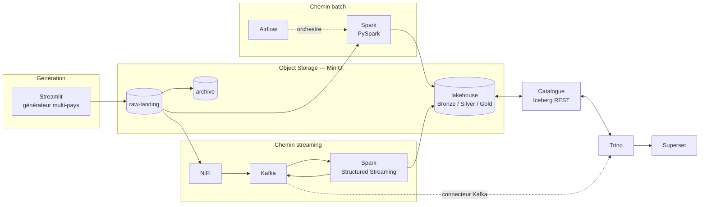

# WABA Group — Plateforme Analytique Financière Multi-Pays

Plateforme Data Lakehouse pour **WestAfrica BancAssur Group**, groupe fictif de banque et
d'assurance implanté dans 8 pays d'Afrique de l'Ouest (CI, SN, ML, BF, GN, TG, BJ, GH).
Réponse au challenge Data Engineer Artefact.

L'architecture suit un **pattern Lambda** organisé autour d'un object storage central
(MinIO + Apache Iceberg) exposé en SQL via Trino.



---

## État d'avancement

| Niveau | Périmètre | État |
|---|---|---|
| **Level 1** | Ingestion & Lakehouse batch (Streamlit, MinIO, Spark, Iceberg, Trino) | 🟡 Socle en place — générateur et jobs Spark en cours |
| **Level 2** | Orchestration Airflow & architecture Médaillon | ⬜ À venir |
| **Level 3** | Pipeline hybride batch & streaming (NiFi, Kafka, Spark Streaming) | ⬜ À venir |
| **Level 4** | Kubernetes, gouvernance & observabilité | ⬜ À venir |

---

## Prérequis

| Outil | Version testée | Remarque |
|---|---|---|
| Docker Engine | 29.x | Docker Desktop sous Windows/macOS |
| Docker Compose | v2 | inclus dans Docker Desktop |
| RAM allouée à Docker | **8 Go minimum** | voir « Contrainte mémoire » plus bas |
| GNU Make | optionnel | sous Windows, utiliser `.\waba.ps1` |

## Démarrage rapide

```bash
git clone <url-du-depot> && cd WABA
cp README.env.example .env     # aucune valeur secrète à renseigner en local
make up-l1                     # MinIO + catalogue Iceberg REST + Trino
make smoke-l1                  # vérifie la chaîne de bout en bout
```

Sous Windows (PowerShell) :

```powershell
Copy-Item README.env.example .env
.\waba.ps1 up-l1
.\waba.ps1 smoke-l1
```

Interfaces exposées :

| Service | URL | Identifiants |
|---|---|---|
| Console MinIO | http://localhost:9001 | ceux du `.env` |
| Trino | http://localhost:8080 | aucun (dev local) |
| Catalogue Iceberg REST | http://localhost:8181 | — |

`make smoke-l1` crée une table Iceberg partitionnée par `country_code`, y insère des lignes, les
relit en SQL, vérifie que les fichiers Parquet ont bien atterri dans `s3://lakehouse`, puis nettoie.
Il sort en code non nul au moindre échec : c'est le contrôle de non-régression du socle.

## Contrainte mémoire — pourquoi des profils

La plateforme complète du Level 4 dépasse 24 Go de RAM. Le développement étant mené sur une machine
de 16 Go, les services sont regroupés en **profils Compose exclusifs** (`l1`, `l2`, `l3`, `l4`)
plutôt que cumulatifs, et chaque service porte une `mem_limit` explicite. Les arbitrages
correspondants (catalogue REST plutôt que Hive Metastore, Spark en local mode, Kafka en KRaft,
Airflow en LocalExecutor) sont justifiés dans [`writeup/decisions.md`](writeup/decisions.md).

Sous Windows, plafonner la mémoire de WSL2 via `%USERPROFILE%\.wslconfig` avant de démarrer Docker :

```ini
[wsl2]
memory=10GB
processors=6
swap=8GB
```

## Structure du dépôt

```
.
├── docker/              # compose.yml (profils par niveau) et configuration des services
│   └── trino/catalog/   # catalogues Trino (credentials injectés par variables d'env)
├── generator/           # Level 1.1 — application Streamlit de génération de données
├── jobs/
│   ├── batch/           # Levels 1-2 — jobs PySpark (raw -> bronze -> silver -> gold)
│   └── streaming/       # Level 3  — jobs Spark Structured Streaming
├── airflow/dags/        # Level 2  — DAGs d'orchestration
├── nifi/                # Level 3  — templates de flux NiFi
├── superset/            # Level 4  — définitions des dashboards
├── k8s/                 # Level 4  — manifestes et charts Helm
├── scripts/             # tests de fumée et utilitaires
├── tests/               # tests unitaires
└── writeup/             # write-up technique (rédigé au fil de l'eau)
```

## Sécurité & données personnelles

- Aucun credential n'est écrit en dur : les fichiers de configuration Trino résolvent les clés
  d'accès à l'exécution via `${ENV:...}`, et `.env` est exclu du dépôt.
- Les données manipulées sont **entièrement synthétiques**. Les champs identifiants (`customer_id`,
  `account_number`, `iban`) sont néanmoins pseudonymisés dans les couches exposées, conformément aux
  contraintes du sujet.
